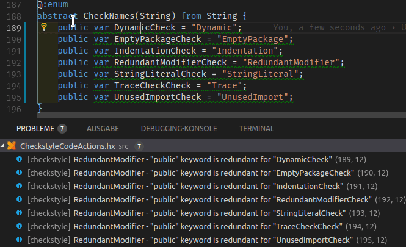
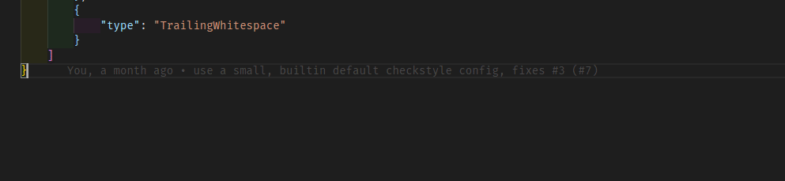

# Haxe Checkstyle for Visual Studio Code

  

## Features

* Runs haxe-checkstyle when opening and saving documents
* Displays results as VS Code diagnostics
* Supports quickfixes for a small selection of checks
* Includes json schema definitions for both `checkstyle.json` and `checkstyle-excludes.json`
* Uses [haxe-checkstyle](https://github.com/HaxeCheckstyle/haxe-checkstyle) engine
* Works with your existing haxe-checkstyle configuration

## Configuration

A configuration key named `haxecheckstyle.sourceFolders` holds an array of folder names where checkstyle should run. It defaults to `["src", "Source"]`, which is the equivalent to passing `-s <src> -s <Source>` to haxe-checkstyle CLI. Checkstyle will ignore any file not included in `sourceFolders`.

vscode-checkstyle accepts your regular haxe-checkstyle configuration files (`checkstyle.json` and `checkstyle-excludes.json`).

Unlike the CLI version vscode-checkstyle will search a file's path for a `checkstyle.json` configuration that is closest to it. Searching moves upwards and stops at (but includes) your workspace root.
That way you can have a library folder inside your workspace provide its own `checkstyle.json` (which might be different from your personal coding style).

If there is no `checkstyle.json` in any folders up to your workspace root, vscode-checkstyle tries to learn its location by reading key `haxecheckstyle.configurationFile` from your VS Code settings. Failing both vscode-checkstyle will use its own builtin default configuration which you can view [here](https://raw.githubusercontent.com/vshaxe/vscode-checkstyle/master/checkstyle.json).

## Quickfixes

You can apply quickfixes one at a time or by selecting a range including multiple checkstyle violations.

The following checks provide quickfixes:
- Dynamic
- EmptyPackage
- Indentation
- RedundantModifier
- StringLiteral
- Trace
- UnusedImport

## JSON Schema Definitions

vscode-checkstyle comes with JSON schemas for `checkstyle.json` and `checkstyle-excludes.json`, which will help you through autocomplete and tooltips when editing both file types. e.g.:

## Documentation

See [Haxe-Checkstyle docs](http://haxecheckstyle.github.io/docs) or use JSON Schema tooltips for documentation on checks.

## TODO

* Check on all the workspace
* And more :)
